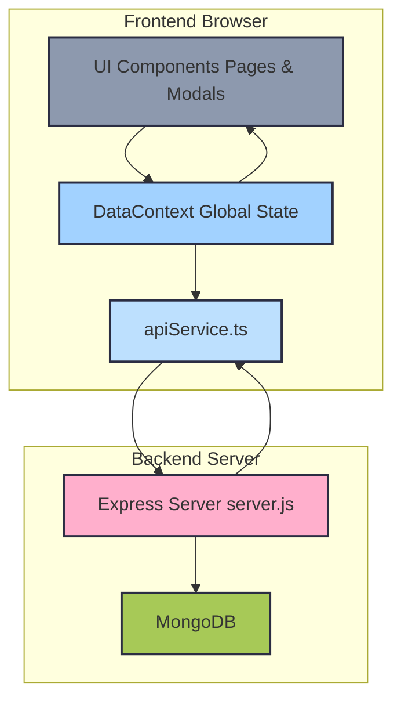
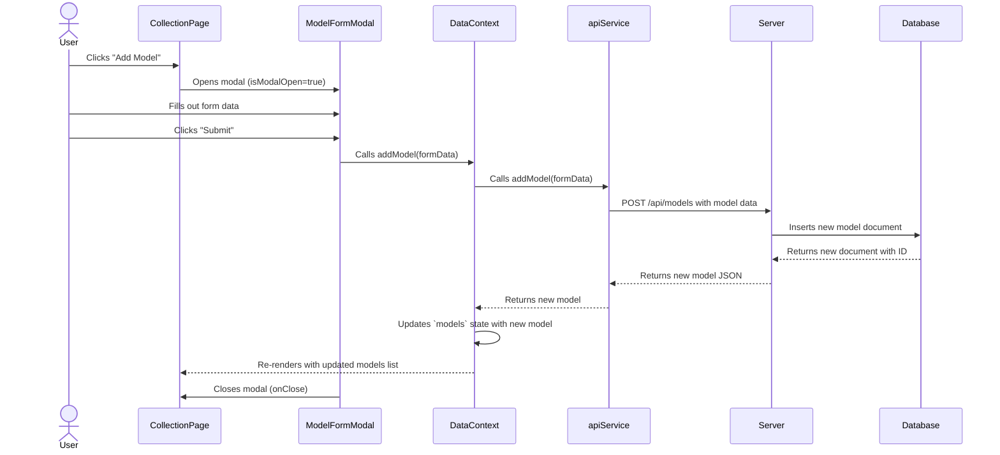
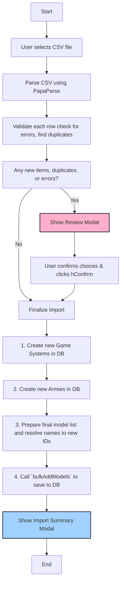

<!--
 * @file README.md
 * @description This file provides an overview of the ModelForge application, its features, and technical architecture using Mermaid diagrams.
 * This program was written by Stuart Mason October 2025.
-->
# ModelForge: Tabletop Model Collector

Welcome to ModelForge, your digital armory for managing tabletop miniatures. This application allows you to catalog your collections, track your painting progress, and organize your forces across all your favorite game systems.

## Key Features

- **Detailed Collection View**: Browse your entire collection with images, descriptions, and current painting status.
- **Progress Dashboard**: Visualize your hobby progress with charts breaking down the status of your models by army and game system.
- **Bulk Data Management**: Easily import your existing collection from a CSV file.
- **Customizable Settings**: Manage the game systems and armies that make up your collection.
- **AI-Powered Descriptions**: Use the Gemini API to automatically generate rich, flavorful descriptions for your models.

## Getting Started

Follow these instructions to get a copy of the project up and running on your local machine.

### Prerequisites

You will need to have [Node.js](https://nodejs.org/) (version 18.x or later) and a package manager like [npm](https://www.npmjs.com/) installed.

### Installation & Setup

1.  **Clone the repository or download the source code:**
    ```bash
    git clone <repository-url>
    cd <project-directory>
    ```

2.  **Install dependencies:**
    Open your terminal in the project's root directory and run:
    ```bash
    npm install
    ```

### Running the Development Server

Once the dependencies are installed, you can start the Vite development server:

```bash
npm run dev
```

Open your web browser and navigate to the local URL provided by Vite (usually `http://localhost:5173`) to see the application running.

## Building for Production

When you are ready to create a production-ready version of your application, you can run the build command:

```bash
npm run build
```

This command will compile the TypeScript/React code and bundle it into a `dist` directory. You can deploy this `dist` folder to any static site hosting service.
---

## Application Flow Diagrams

These diagrams illustrate the architecture and data flow of the application.

### 1. Overall Data Flow

This diagram shows the high-level architecture, from the user interface down to the database. The frontend is built with React and uses a global Context for state management, which communicates with a backend Express server via a dedicated API service.



### 2. User Interaction: Adding a New Model

This sequence diagram details the step-by-step process of a user adding a single new model to their collection through the UI.



### 3. Bulk CSV Import Flow

This flowchart illustrates the logic behind the CSV import feature, from file parsing and validation to the final import summary. The process includes a review step for the user to handle potential duplicates and errors.


