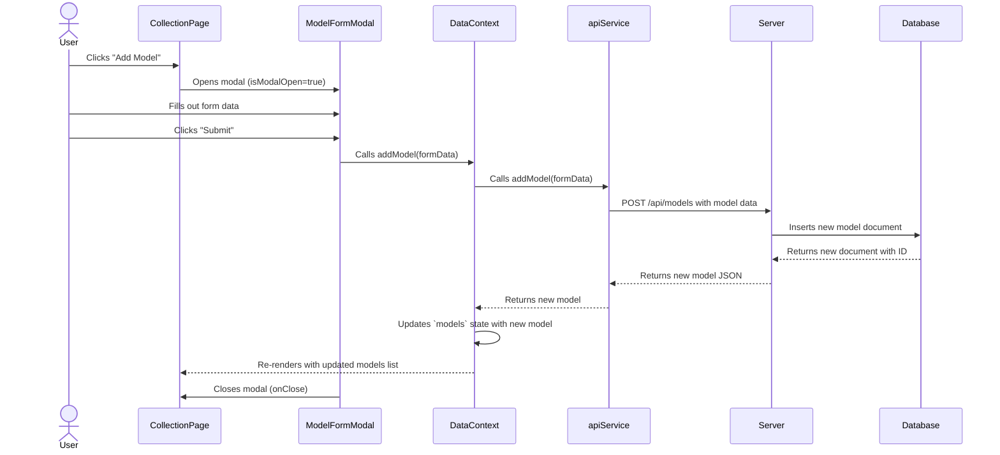

<!--
 * @file README.md
 * @description This file provides an overview of the ModelForge application, its features, and technical architecture using Mermaid diagrams.
 * This program was written by Stuart Mason October 2025.
-->
# ModelForge: Tabletop Model Collector

Welcome to ModelForge, your digital armory for managing tabletop miniatures. This application allows you to catalog your collections, track your painting progress, and organize your forces across all your favorite game systems.

## Key Features

- **Detailed Collection View**: Browse your entire collection with images, descriptions, and current painting status.
- **Progress Dashboard**: Visualize your hobby progress with charts breaking down the status of your models by army and game system.
- **Bulk Data Management**: Easily import your existing collection from a CSV file.
- **Customizable Settings**: Manage the game systems and armies that make up your collection.
- **AI-Powered Descriptions**: Use the Gemini API to automatically generate rich, flavorful descriptions for your models.

---

## Application Flow Diagrams

These diagrams illustrate the architecture and data flow of the application.

### 1. Overall Data Flow

This diagram shows the high-level architecture, from the user interface down to the database. The frontend is built with React and uses a global Context for state management, which communicates with a backend Express server via a dedicated API service.

```mermaid
graph TD
    subgraph A[Frontend (Browser)]
        A1[UI Components (Pages & Modals)] -- Calls functions --> B(DataContext Global State);
        B -- Updates state & triggers re-render --> A1;
        B -- Calls API methods --> C(apiService.ts);
    end

    subgraph Backend (Server)
        D[Express Server (server.js)] -- CRUD operations --> E(MongoDB);
    end

    C -- HTTP Requests (fetch) --> D;
    D -- HTTP Responses (JSON) --> C;

    style A1 fill:#8d99ae,stroke:#2b2d42,stroke-width:2px
    style B fill:#a2d2ff,stroke:#2b2d42,stroke-width:2px
    style C fill:#bde0fe,stroke:#2b2d42,stroke-width:2px
    style D fill:#ffafcc,stroke:#2b2d42,stroke-width:2px
    style E fill:#a7c957,stroke:#2b2d42,stroke-width:2px
```

### 2. User Interaction: Adding a New Model

This sequence diagram details the step-by-step process of a user adding a single new model to their collection through the UI.



### 3. Bulk CSV Import Flow

This flowchart illustrates the logic behind the CSV import feature, from file parsing and validation to the final import summary. The process includes a review step for the user to handle potential duplicates and errors.

```mermaid
graph TD
    A[Start] --> B[User selects CSV file];
    B --> C[Parse CSV using PapaParse];
    C --> D[Validate each row (check for errors, find duplicates)];
    D --> E[Any new items, duplicates, or errors?];
    E -- No --> F[Finalize Import];
    E -- Yes --> G[Show Review Modal];
    G --> H[User confirms choices & clicks "Confirm"];
    H --> F;
    F --> I[1. Create new Game Systems in DB];
    I --> J[2. Create new Armies in DB];
    J --> K[3. Prepare final model list (resolve names to new IDs)];
    K --> L[4. Call `bulkAddModels` to save to DB];
    L --> M[Show Import Summary Modal];
    M --> N[End];

    style G fill:#ffafcc,stroke:#2b2d42,stroke-width:2px
    style M fill:#a2d2ff,stroke:#2b2d42,stroke-width:2px
```
