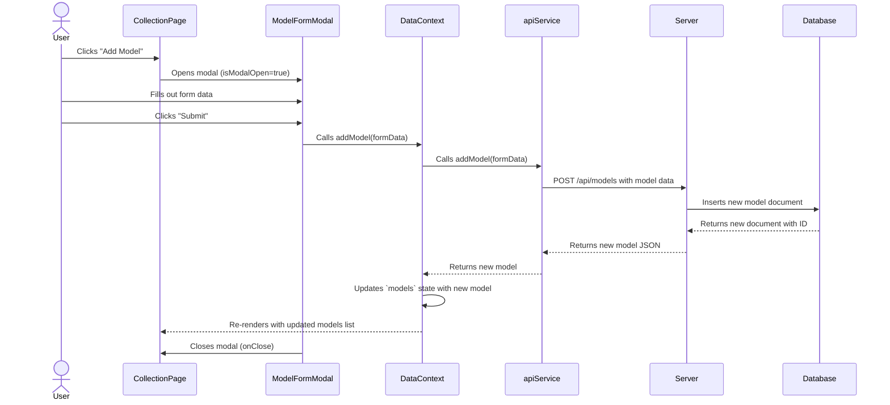
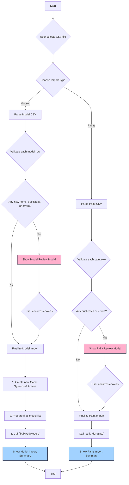
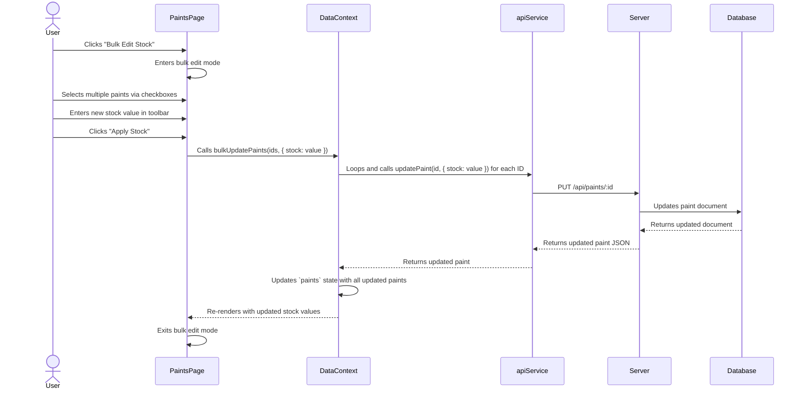
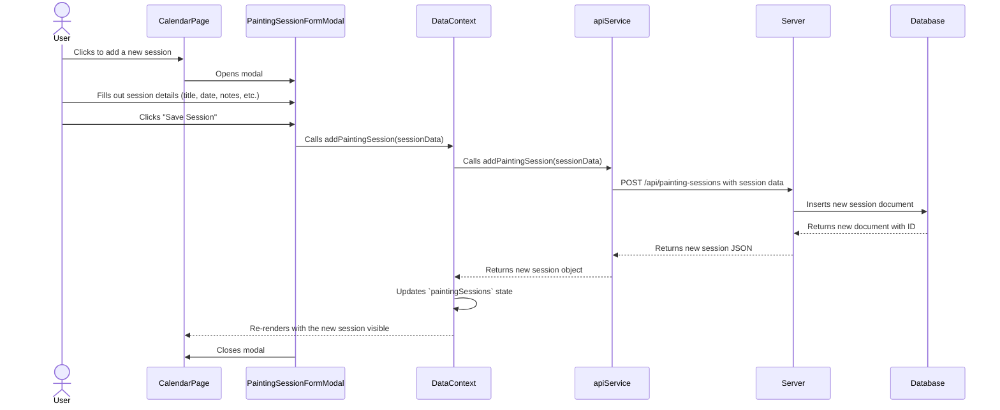

<!--
 * @file README.md
 * @description This file provides an overview of the ModelForge application, its features, and technical architecture using Mermaid diagrams.
 * This program was written by Stuart Mason October 2025.
-->
# ModelForge: Tabletop Model Collector

Welcome to ModelForge, your digital armory for managing tabletop miniatures. This application allows you to catalog your collections, track your painting progress, and organize your forces across all your favorite game systems.

## Key Features

- **Detailed Collection View**: Browse your entire collection with images, descriptions, and current painting status.
- **Progress Dashboard**: Visualize your hobby progress with filterable charts breaking down the status of your models by army and game system.
- **Painting Session Calendar**: Schedule your hobby time, link models to sessions, and keep track of your painting commitments.
- **Paint Collection Management**: Keep a detailed inventory of your hobby paints, including stock levels.
- **Dynamic Theming**: Customize the look and feel of your collection by assigning unique color schemes to each game system.
- **Bulk Data Management**: Easily import your existing collection of models or paints from a CSV file, and bulk-edit paint stock levels.
- **Customizable Settings**: Manage the game systems (including color themes) and armies that make up your collection.
- **AI-Powered Descriptions**: Use the Gemini API to automatically generate rich, flavorful descriptions for your models.

---

## Application Flow Diagrams

These diagrams illustrate the architecture and data flow of the application.

### 1. Overall Data Flow

This diagram shows the high-level architecture, from the user interface down to the database. The frontend is built with React and uses a global Context for state management, which communicates with a backend Express server via a dedicated API service.

```mermaid
graph TD
    subgraph Frontend (Browser)
        A[UI Components <br>(Pages & Modals)] -- Calls functions --> B(DataContext <br>Global State);
        B -- Updates state & triggers re-render --> A;
        B -- Calls API methods --> C(apiService.ts);
    end

    subgraph Backend (Server)
        D[Express Server <br>(server.js)] -- CRUD operations --> E(MongoDB);
    end

    C -- HTTP Requests (fetch) --> D;
    D -- HTTP Responses (JSON) --> C;

    style A fill:#8d99ae,stroke:#2b2d42,stroke-width:2px
    style B fill:#a2d2ff,stroke:#2b2d42,stroke-width:2px
    style C fill:#bde0fe,stroke:#2b2d42,stroke-width:2px
    style D fill:#ffafcc,stroke:#2b2d42,stroke-width:2px
    style E fill:#a7c957,stroke:#2b2d42,stroke-width:2px
```

### 2. User Interaction: Adding a New Model

This sequence diagram details the step-by-step process of a user adding a single new model to their collection through the UI.



### 3. Bulk CSV Import Flow

This flowchart illustrates the logic for importing either models or paints from a CSV file. The process includes validation and a user review step.



### 4. User Interaction: Bulk Updating Paint Stock

This diagram shows the process of a user entering bulk edit mode on the Paints page to update the stock levels for multiple items at once.



### 5. User Interaction: Scheduling a Painting Session

This diagram details the flow for adding a new event to the painting calendar.


